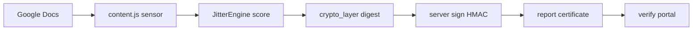

<div align="center">

# JITTER

### Human Writing Protocol

[](https://scalisos.com)
[]([https://chromewebstore.google.com/detail/jitter-human-writing-prot/fdogigjejmephndmggbeffogkinip](https://chromewebstore.google.com/detail/jitter/fdogigjejmephndmblmggbeffogkinip))

[](LICENSE)
[](extension/manifest.json)
[](https://developer.mozilla.org/en-US/docs/Web/JavaScript)
[](https://workers.cloudflare.com/)


*Cryptographic proof of human authorship for the age of AI-generated text.*

</div>

---

## The Concept & Impact

In education, hiring, journalism, and legal work, people need to know whether writing came from a human. Detector tools guess from text patterns. They misfire, they can be gamed, and they leave no durable record. There is no shared, cryptographic way to show that a person actually typed a document.

JITTER watches how you write, not what you write. Keystroke timing stays on your device. The extension turns that signal into a deterministic Humanity Score, then asks a remote vault to sign a digest of the session. The result is a certificate and clipboard seal anyone can verify later without seeing your document text.

---

## How It Works

Open a Google Doc. The extension observes keystroke timing while you write, computes a Humanity Score locally, and encrypts session data in the browser. When you request a certificate, the vault signs a SHA-256 digest of your score details. You get a PDF-ready forensic report and a rich HTML seal. Anyone can paste that seal or upload the PDF at the [verification portal](verify/) to confirm the signature independently.



### Humanity Score Tiers

| Score | Tier | Meaning |
|-------|------|---------|
| 90-100 | **Human Original** | Strong organic typing signal |
| 60-89 | **Human-Led** | Mostly human, some paste or assistance |
| 20-59 | **AI-Driven** | Weak biometric signal relative to content |
| 0-19 | **AI Generated** | Minimal typing; heavy paste ratio |

---

## Quick Start

**Prerequisites:** Google Chrome (or Chromium), Node.js 18+ and [Wrangler](https://developers.cloudflare.com/workers/wrangler/install-and-update/) if you run the backend locally.

1. **Clone**

```bash
git clone https://github.com/yoavyoscovitz-wq/jitter.git
cd JITTER
```

2. **Configure.** Edit [extension/config.js](extension/config.js) and host permissions in [extension/manifest.json](extension/manifest.json). See [.env.example](.env.example) for what each URL means.

3. **Load.** Open `chrome://extensions`, enable Developer mode, click **Load unpacked**, select the `extension/` folder.

4. **Type.** Open a Google Doc. After enough keystrokes, the Guardian HUD appears.

*To issue signed certificates locally, run the vault with Wrangler in `server/jitter-db-api`. Backend setup, the verification portal, and contract tests are in the sections below.*

---

## Behind the Code

**Developed by Yoav Yoscovitz**

[LinkedIn](https://www.linkedin.com/in/yoav-yoscovitz/) · [GitHub](https://github.com/yoavyoscovitz-wq)

JITTER is an open experiment in authorship attestation at the intersection of keystroke biometrics, browser extensions, and applied cryptography.

---

## Legal Disclaimer

This is open-source software provided **AS IS** for portfolio and educational purposes. The author accepts **no liability** for data loss, privacy incidents, security issues, academic outcomes, legal consequences, or any other result of using or deploying this project.

Humanity Scores are estimates based on keystroke dynamics. They are **not forensic evidence** and do not constitute a legal attestation of authorship. You are responsible for compliance with applicable laws, platform terms, and ethical guidelines in your jurisdiction.

> **THIS SOFTWARE IS PROVIDED "AS IS", WITHOUT WARRANTY OF ANY KIND, EXPRESS OR IMPLIED, INCLUDING BUT NOT LIMITED TO THE WARRANTIES OF MERCHANTABILITY, FITNESS FOR A PARTICULAR PURPOSE, AND NONINFRINGEMENT.**

---

<details>
<summary><strong>Architecture</strong></summary>

<br>

```
JITTER/
├── extension/              # Chrome Extension (Manifest V3)
│   ├── manifest.json       # Permissions, CSP, content script wiring
│   ├── config.js           # Backend URLs (edit before loading)
│   ├── jitter_core.js      # JitterEngine biometric scoring
│   ├── crypto_layer.js     # AES-256-GCM encryption + SHA-256 digests
│   ├── content.js          # Keystroke sensor + Guardian HUD (Google Docs)
│   ├── background.js       # Service worker
│   ├── popup.*             # Live tier display
│   ├── onboarding.*        # First-run carousel
│   ├── report.*            # Forensic certificate + PDF export
│   ├── jitter_seal_clipboard.js
│   ├── assets/             # Mascot imagery (WebP)
│   ├── fonts/              # Bundled Inter typeface
│   └── libs/               # html2canvas, jsPDF, pdf-lib, PDFObject
│
├── server/                 # Cloudflare Workers + Pages Functions
│   ├── functions/
│   │   ├── sign.js         # POST /sign
│   │   └── verify.js       # POST /verify
│   └── jitter-db-api/      # Registry Worker
│       ├── src/index.js    # GET /verify/:id, POST /save
│       └── wrangler.toml
│
├── verify/                 # Verification portal (static HTML)
├── docs/                   # CONTRACTS.md, PRIVACY.md
├── tools/                  # Build scripts
├── e2e-vault-verify.mjs    # Sign/verify contract test
└── .env.example
```

</details>

<details>
<summary><strong>API Contracts</strong></summary>

<br>

Full HTTP request and response shapes are in [`docs/CONTRACTS.md`](docs/CONTRACTS.md).

| Endpoint | Method | Description |
|----------|--------|-------------|
| `/sign` | `POST` | HMAC-SHA256 signing of a session digest |
| `/verify` | `POST` | Cryptographic signature verification |
| `/save` | `POST` | Registry write: store session metadata |
| `/verify/:id` | `GET` | Registry read: fetch session by document ID |

</details>

<details>
<summary><strong>Privacy</strong></summary>

<br>

Keystroke timing analysis runs entirely on your device. **No raw document text is transmitted.** When a certificate is requested, the signing server receives only:

- `documentId`: pseudonymous ID from document URL and timestamp
- `entropyData`: SHA-256 digest of canonical score details
- `textHash`: SHA-256 of a normalized sample of typing-derived words (optional)
- `score`: rounded Humanity Score (0-100)
- `wordCount`: approximate session word count

Session data at rest in the browser is encrypted with AES-256-GCM. See [`docs/PRIVACY.md`](docs/PRIVACY.md) for the full disclosure.

</details>

<details>
<summary><strong>Deployment & Local Backend</strong></summary>

<br>

**Run the vault locally:**

```bash
cd server/jitter-db-api
npm install
export JITTER_HMAC_SECRET="your-256-bit-secret-here"   # PowerShell: $env:JITTER_HMAC_SECRET="..."
wrangler dev
```

Signing and verify endpoints are at `http://localhost:8787`.

**Open the verification portal** (no dependencies):

```bash
# macOS / Linux
open verify/index.html

# Windows
start verify/index.html
```

**E2E contract test** (from repository root):

```bash
JITTER_HMAC_SECRET="your-secret" VAULT_BASE="http://localhost:8787" node e2e-vault-verify.mjs
```

**Production:** the backend targets Cloudflare Pages + Workers (free tier covers typical usage).

1. Fork this repo
2. Connect to [Cloudflare Pages](https://pages.cloudflare.com/)
3. Set `JITTER_HMAC_SECRET` as a Worker secret (`wrangler secret put JITTER_HMAC_SECRET`)
4. Deploy the registry Worker (`cd server/jitter-db-api && wrangler deploy`)
5. Update `extension/config.js` with your deployed URLs

The verification portal (`verify/`) can be hosted on any static host (Cloudflare Pages, Netlify, GitHub Pages).

</details>

<details>
<summary><strong>Contributing</strong></summary>

<br>

Contributions are welcome. Open an issue before a large pull request so we can align on scope.

1. Fork, branch, commit
2. Ensure `e2e-vault-verify.mjs` passes against your local server
3. Open a pull request with a clear description

</details>

---

[MIT License](LICENSE) · © 2026 Yoav Yoscovitz
